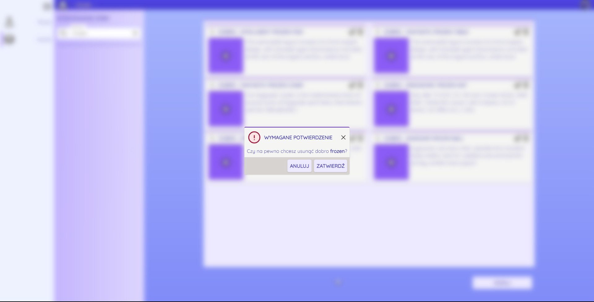

# Projekt zaliczeniowy z przedmiotu Programowanie wizualne

## Opis projektu

Projekt ma na celu stworzenie aplikacji do zarządzania bazą danych. Aplikacja ma umożliwiać dodawanie, usuwanie, edycję
oraz wyświetlanie danych z bazy danych. Aplikacja ma być napisana w języku C# z wykorzystaniem blazor'a jako aplikacja
webowa.

Dodatkowo interfejs użytkownika musi pozwalać na przeglądanie danych zagnieżdżonych w tabelach oraz pozwalać na
dodawanie/odczytywanie/filtrowanie/wyszukiwanie/edycję i usuwanie danych z tabel.

Dodatkowym wymaganiem jest wykorzystanie dynamicznej zmiany bazy danych przy wykorzystaniu entity-framework.

## Użyte technologie

* [C#](https://docs.microsoft.com/dotnet/csharp/) - język programowania
* [.net7.0](https://dotnet.microsoft.com/) - framework
* [Entity Framework](https://docs.microsoft.com/en-us/ef/) - ORM
* [Blazor](https://blazor.net) - web framework
* [Tailwindcss](https://tailwindcss.com/) - baza do stylizacji
* [Sqlite](https://www.sqlite.org/index.html) - baza danych

### Użyte ikony - [Heroicons](https://heroicons.com/)

### Struktura

- [UI](./UI/UI.csproj) - zawiera interfejs użytkownika
- [Logic](./Logic/Logic.csproj) - zawiera logikę biznesową
- [DTO](./DTO/DTO.csproj) - zawiera obiekty do przesyłania danych
- [Models](./Models/Models.csproj) - zawiera modele bazy danych

### Konfiguracja

Aby uruchomić projekt należy:

- Wejść do folderu UI i wykonać komendę `dotnet run` lub `dotnet watch`

Aby uruchomić bazę danych w pamięci należy:

- Wejść do folderu UI i dodać do pliku [appsettings.json](UI/appsettings.json) następującą linię:

```json
"UseInMemoryDatabase": true
```

Aby uruchomić bazę danych dyskową należy:

- Wejść do folderu UI i dodać do pliku [appsettings.json](UI/appsettings.json) następującą linię:

```json
"UseInMemoryDatabase": false
```

### Wygląd aplikacji

- Widok główny


- Widok tabeli dóbr z filtrowaniem


- Widok tabeli dóbr z modelem edycji


- Widok tabeli dóbr z modelem potwierdzenia usunięcia



- Widok szczegółów dostępnego dobra


- Widok tabeli ras 


- Widok tabeli ras z modelem edycji


- Widok szczegółów dostępnej rasy


